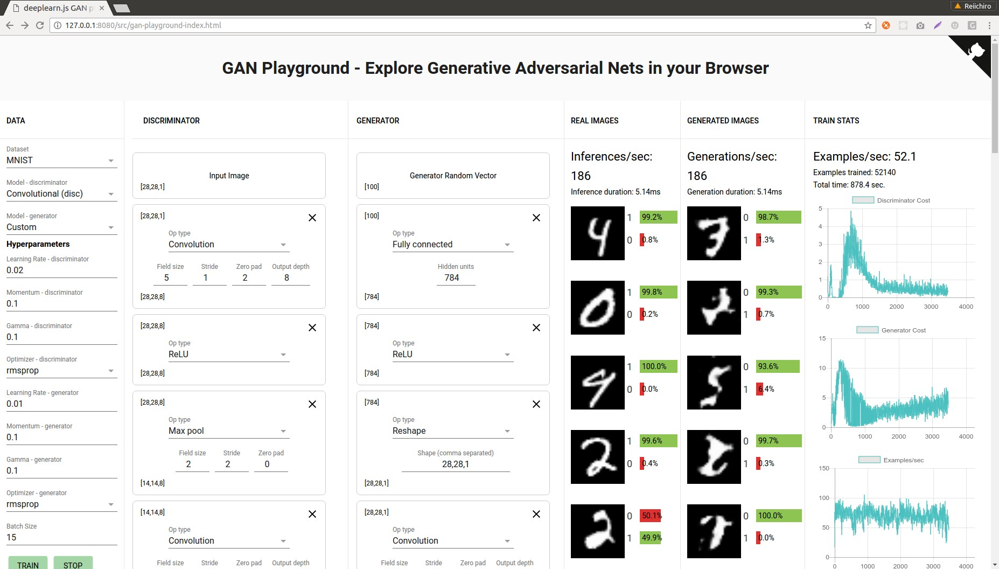

# Welcome to GAN Playground

Demo website: https://adicio-ai.github.io/gan-playground/



## FAQ

### What is this about?

GAN Playground is a really nice graphical way of illustrating how Generative Adversarial Networks work. Currently, it contains three built-in datasets: MNIST, Fashion MNIST, and CIFAR-10.

GAN Playground provides you the ability to set your models' hyperparameters and build up your discriminator and generator layer-by-layer. You can observe the network learn in real time as the generator produces more and more realistic images, or more likely, gets stuck in failure modes such as mode collapse.

### What are Generative Adversarial Networks?

From Wikipedia, "Generative Adversarial Networks, or GANs, are a class of artifical intelligence algorithms used in unsupervised machine learning, implemented by a system of two neural networks contesting with each other in a zero-sum game framework. They were introduced by Ian Goodfellow et al. in 2014."

In the words of Reiichiro Nakano, GANs are composed of two neural networks, each one trying to outcompete the other. The **discriminator** tries to figure out whether a given image is real or synthetically generated by the other neural network. The **generator** attempts to output images that are indistinguishable from real ones in an attempt to fool the discriminator. The hope is that the generator learns enough to create realistic images that can *fool humans*. If you want more information, there are tons of great resources on the internet that give a good introduction to GANs. Here's the [original paper on GANs](https://arxiv.org/abs/1406.2661).

### Why did you make this?

Our aim was to simplify Reiichiro Nakano's project to give beginners a bit of exposure in training GANs so it will produce results more easily. We reckon a browser based model is accessible to a wide range of students.

### How long should I wait / what's the best set of parameters to see realistic images?

GANs are notoriously hard to train. As Reiichiro Nakano  said, "Even I haven't found the right set of parameters and layers for this demo that'd produce very realistic images." We aim to change that by supplying default parameters you can use to produce results without too much difficulty.

### This looks like the deeplearn.JS Model Builder demo.
Yup, this is pretty much deeplearn.JS's Model Builder demo repurposed for training GANs by Reiichiro Nakano and then adapted and simplified by Adicio. We removed the parts <i>we</i> didn't need and refined the hyperparameters to produce images reliably.

## Development

To run this locally, clone the project from here or from the Nakano repository and prepare the development environment:

```bash
$ git clone https://github.com/reiinakano/gan-playground.git
$ cd gan-playground
$ npm install && bower install # Install node modules and bower components
```

To interactively develop the application

```bash
$ ./scripts/watch-demo src/gan-playground.ts
>> Waiting for initial compile...
>> 1023189 bytes written to src/bundle.js (0.71 seconds) at 2:20:06 AM
>> Starting up http-server, serving ./
>> Available on:
>>   http://127.0.0.1:8080
>> Hit CTRL-C to stop the server
```
